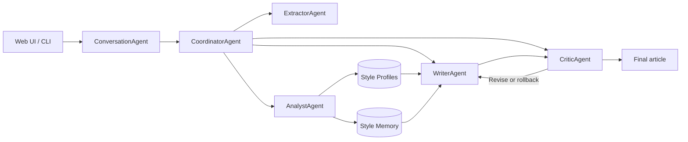

<p align="center">
  
</p>

<h1 align="center">EchoStyle</h1>

<p align="center">
  面向中文写作的多智能体文风建模、文档问答与可控创作工作台
</p>

EchoStyle 从 PDF、Word、Markdown、纯文本或微信公众号文章中提取内容，建立可持久化的个人文风画像与风格记忆，并通过对话完成资料问答、文风分析、文章创作和迭代修改。

项目当前优先验证中文写作。英文处理尚未作为主要准确性目标。

## 主要能力

- **对话式工作台**：上传文件后直接用自然语言提出问题或写作任务。
- **文档解析**：PDF 默认使用 MinerU，失败时回退到 MarkItDown；同时支持 DOCX、Markdown、TXT 和微信公众号链接。
- **文风建模**：结合统计语言学指标与 LLM 语义分析生成 `DeepStyleProfile`。
- **风格记忆**：将样文按篇章功能切片，使用 Dense + BM25 + RRF 进行检索。
- **受控写作**：Coordinator 调度 Writer 与 Critic，在有限状态机中执行生成、评价、修改和回滚。
- **连续对话**：自动估算上下文占用，并在接近上限时压缩较早消息。
- **实验工具**：提供消融实验、样本规模实验、双盲评测和失败案例分析。

## 快速开始

### 1. 安装项目

需要 Python 3.10 或更高版本，并建议使用 [uv](https://docs.astral.sh/uv/) 管理环境。

```powershell
git clone https://github.com/Lk-1ndex/EchoStyle.git
cd EchoStyle
uv sync
Copy-Item config.example.yaml config.yaml
```

macOS 或 Linux 使用：

```bash
cp config.example.yaml config.yaml
```

### 2. 配置模型

编辑本地 `config.yaml`。至少需要配置生成模型；建立 Dense 风格记忆时还应配置 Embedding 服务。

```yaml
llm:
  api_key: "your-llm-api-key"
  base_url: "https://api.deepseek.com"
  model: "deepseek-flash"
  temperature: 0.7
  max_tokens: 4096
  thinking_effort: "auto"

embedding:
  api_key: "your-embedding-api-key"
  base_url: "https://api.siliconflow.cn/v1"
  model: "Pro/BAAI/bge-m3"
```

模型接口需要兼容 OpenAI 风格的 Chat Completions 或 Embeddings 协议。完整配置项及默认值见 [`config.example.yaml`](config.example.yaml)。

也可以使用环境变量覆盖部分敏感配置：

| 变量 | 用途 |
| --- | --- |
| `OPENAI_API_KEY` | 生成模型 API Key |
| `OPENAI_BASE_URL` | 生成模型 Base URL |
| `EMBEDDING_API_KEY` | Embedding API Key |
| `EMBEDDING_BASE_URL` | Embedding Base URL |
| `EMBEDDING_MODEL` | Embedding 模型名 |
| `EVALUATOR_API_KEY` | 独立评测模型 API Key |
| `EVALUATOR_BASE_URL` | 独立评测模型 Base URL |
| `EVALUATOR_MODEL` | 独立评测模型名 |

`config.yaml` 已被 Git 忽略。不要把真实 API Key 写入 `config.example.yaml` 或提交到仓库。

### 3. 安装 MinerU

普通文本和 DOCX 不需要 MinerU。只有需要高质量解析 PDF 时才需要额外安装它。为避免依赖冲突，建议把 MinerU 作为独立的 uv tool 安装：

```powershell
uv tool install --python 3.12 "mineru>=4.0,<5"
mineru-kit models download --tier basic --small-backend onnx
```

`basic` 适合内存有限或主要使用 CPU 的机器。需要更高版面解析质量时，可以下载 `standard` 模型，并把 `config.yaml` 中的 `mineru_tier` 改为 `standard`：

```powershell
mineru-kit models download --tier standard --small-backend onnx --vlm-engine llama-cpp
```

默认 PDF 配置采用保守线程数，以降低峰值内存：

```yaml
extractor:
  pdf_engine: "mineru"
  mineru_tier: "basic"
  mineru_timeout: 900
  mineru_intra_op_num_threads: 2
  mineru_inter_op_num_threads: 1
  mineru_pdf_render_threads: 1
  mineru_malloc_trim: true
```

如果 MinerU 命令不可用、解析超时或没有产生有效 Markdown，系统会记录原因并回退到 MarkItDown。

### 4. 启动 Web 工作台

```powershell
uv run streamlit run src/web/app.py
```

浏览器打开 `http://127.0.0.1:8501`。在输入框中添加文件，然后直接描述任务，例如：

- `总结这两篇论文的核心结论，并标出来源。`
- `分析这些文章的文风，建立“技术评论”画像。`
- `参考上传资料，并使用当前画像写一篇 1500 字的中文文章。`
- `把上一稿第二段改得更通俗，其他部分保持不变。`

## 支持的输入

| 输入 | 处理方式 |
| --- | --- |
| PDF | MinerU 优先，MarkItDown 故障回退 |
| DOCX | MarkItDown 提取并清洗 |
| Markdown / TXT | 直接读取并清洗 |
| 微信公众号文章 | 从 `mp.weixin.qq.com` 链接提取正文 |

旧版 `.doc` 文件目前不受支持，请先转换为 `.docx`。

## 系统架构

EchoStyle 是多智能体系统，但不是让多个 Agent 自由讨论。`ConversationAgent` 负责理解用户意图，`CoordinatorAgent` 通过工具注册表和有限状态机执行受控工作流。



| 组件 | 职责 |
| --- | --- |
| `ConversationAgent` | 路由聊天、问答、建模、写作和修改意图 |
| `CoordinatorAgent` | 调度工具、维护 FSM、管理检查点与反思轮次 |
| `ExtractorAgent` | 识别输入类型并提取、清洗正文 |
| `AnalystAgent` | 计算语言学指标、生成画像并写入风格记忆 |
| `WriterAgent` | 组合画像、检索片段和任务约束生成文章 |
| `CriticAgent` | 评价草稿并返回接受、修改或重写决策 |

## 数据与上下文

### 持久化范围

| 数据 | 位置 | 重启后保留 |
| --- | --- | :---: |
| 完整文风画像及当前激活项 | `profiles/deep_style_profiles_v2.json` | 是 |
| 风格记忆切片及向量 | `profiles/style_memory_v2.json` | 是 |
| 当前聊天记录 | Streamlit Session State | 否 |
| 当前对话上传的文件 | Streamlit Session State | 否 |
| 自动压缩摘要 | Streamlit Session State | 否 |

画像和记忆按 `profile_id` 隔离。旧版、缺少 `profile_id` 的画像不能直接用于写作，需要重新执行建模。

### 自动上下文压缩

系统会在每次请求前估算历史消息、文档、画像和摘要的 Token 占用：

- 应用软上限默认为 32K Token，同时受实际模型上下文窗口和输出预算限制。
- 有效上下文达到软上限的 75% 后自动压缩。
- 最近 6 条消息保留原文，更早的消息增量合并到摘要。
- 用户目标、硬性约束、主题、格式等内容会作为原文锚点额外保留。
- 摘要模型不可用时使用确定性的本地回退方案。

压缩能够显著延长连续写作会话，但不能保证摘要与完整原文绝对等价。重要事实仍应以已上传资料或原文为准。

## CLI 使用

### 提取文档

```powershell
uv run python main.py extract -s "article.pdf" -o "article.md"
```

### 建立文风画像

```powershell
uv run python main.py distill -i "sample-1.md" "sample-2.docx" -n "技术评论"
```

### 使用画像写作

```powershell
uv run python main.py write `
  -p "profiles/技术评论_deep_profile.json" `
  -t "为什么复杂系统需要可观测性？" `
  -k "从工程协作与故障恢复两个角度展开" `
  -w 1500 `
  -o "article.md"
```

上面的示例使用 PowerShell 续行语法；在其他 Shell 中可以把参数写在同一行。

## 测试

```powershell
uv run pytest -q
```

请使用 `uv run`，避免误用缺少项目依赖的系统 Python。真实网络和外部模型测试默认不会作为普通单元测试执行。

仓库中的 [`ci/pytest.yml`](ci/pytest.yml) 是 GitHub Actions 工作流模板。若要启用远程 CI，需要将它放到 `.github/workflows/pytest.yml`。

## 实验与评测

```powershell
# 七条件消融实验
uv run python main.py benchmark --ablation

# 样本规模与收敛实验
uv run python main.py benchmark --scaling

# 成对双盲评测
uv run python main.py benchmark --blind

# 失败案例分析
uv run python main.py benchmark --failure

# A/B 对照实验
uv run python main.py benchmark --ab
```

消融和双盲流程支持 `--simulate`，用于离线验证实验管道。模拟数据不是模型真实性能结果；正式在线实验需要有效 API，并在裁判调用失败或返回无效结果时终止，避免静默混入本地规则评分。

## 常见问题

### MinerU 出现内存分配错误

优先使用 `basic` 模型和默认保守线程数。EchoStyle 会逐个文件解析，并以 1 MB 分块写入临时文件，避免额外保留整批上传内容；但 MinerU 自身仍会占用模型和页面渲染内存。超大 PDF 建议单独上传，并关闭其他高内存任务。

### Embedding 请求失败

确认 `embedding.api_key`、`embedding.base_url` 和 `embedding.model` 属于同一个服务商。普通检索允许降级到 BM25；严格消融实验会直接失败，以保证实验条件没有被悄悄改变。

### 依赖已安装但命令仍然报缺包

使用 `uv run ...` 或先激活项目的 `.venv`。直接运行系统级 `python`、`pytest` 或 `streamlit` 可能使用另一个环境。

## 目录结构

```text
EchoStyle/
├── src/
│   ├── agents/       # 对话路由、调度、提取、分析、写作与审校 Agent
│   ├── analyzer/     # 统计语言学与文风蒸馏
│   ├── core/         # 配置、模型接口、数据模型与上下文管理
│   ├── evaluation/   # 文风、节奏、篇章与盲评指标
│   ├── extractors/   # PDF、DOCX、文本和微信文章解析
│   ├── generator/    # 写作提示与合成逻辑
│   ├── memory/       # 画像存储、向量库与 RRF 检索
│   └── web/          # Streamlit 工作台与样式资源
├── experiments/      # 消融、规模、盲评、A/B 与失败分析
├── tests/            # 单元和集成测试
├── ci/               # CI 工作流模板
├── main.py           # CLI 入口
├── config.example.yaml
└── pyproject.toml
```
